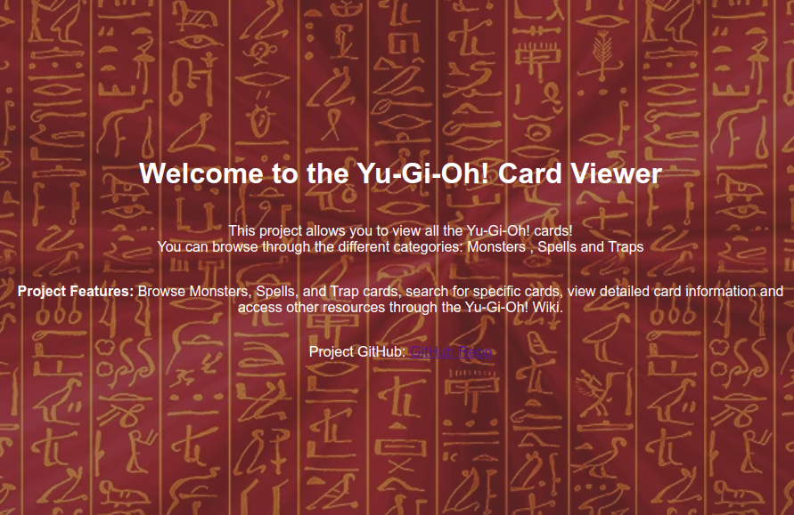

# Yu-Gi-Oh! Card Viewer

A simple web app built using Flask, allowing users to search and view Yu-Gi-Oh! cards (Monsters, Spells, Traps).

## Features

- View cards (Monsters, Spells, Traps) with their images and descriptions.
- Search for specific cards.
- Links to the Yu-Gi-Oh! Wiki for further details on each card.

## Libraries Used

- Python
- Flask
- Requests (for API calls)
- HTML/CSS

## Acknowledgments

- Thanks to [Ygoprodeck API](https://ygoprodeck.com/) for providing the card data.
